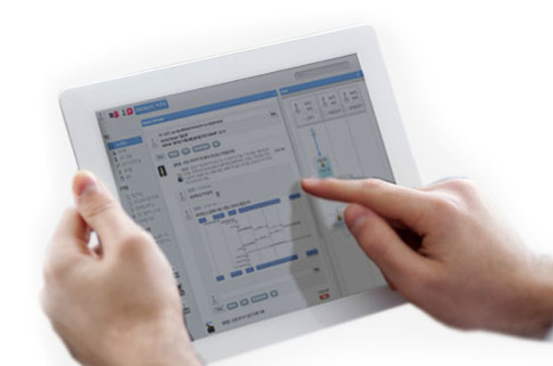
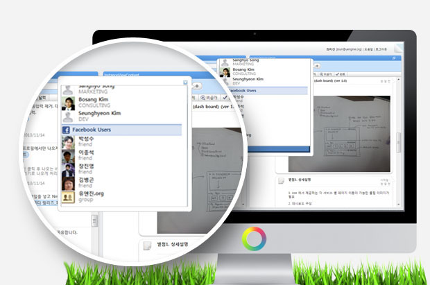

<!-- header 시작 -->

  
UENGINE PAAS ENGINE (UPE)

아마존은 하루에만 25000회 이상의 재배포를 수행하면서도 다운타임이 '제로' 입니다. 운영자동화는 더이상 먼 꿈이 아닙니다. 이미 가상화 기술에 의하여 여러분의 서비스 환경은 자동적으로 다루어질 수 있고 다양한 공개된 도구들을 통하여 자동빌드, 무정지 재배포, 자동화된 테스트, 롤백 등을 수행할 수 있음이 넷플릭스 등의 사례에서 검증되었습니다. 유엔진의 PaaS환경인 [가루다]는 도커엔진과 유엔진의 클라우드 플랫폼, 그리고 유엔진 BPMS 를 통하여 자동화된 운영 프로세스를 지원합니다. MSA 플랫폼, DDD 분석 기법, 그리고 BPM을 기반한 수준 높은 운영자동화 환경을 구축하십시오.

<iframe style="width:100%; height:300px;" src="https://www.youtube.com/embed/pob2_EF1TU4" title="YouTube video player" frameborder="0" allow="accelerometer; autoplay; clipboard-write; encrypted-media; gyroscope; picture-in-picture" allowfullscreen>
</iframe>

  

  <a href="https://github.com/TheOpenCloudEngine/uEngine-cloud" class="md-button" style="vertical-align:middle">
    Github
  </a>
  <a href="http://uengine.org/uEngine-cloud/#/" class="md-button" style="vertical-align:middle">
    Guide
  </a>
  <a href="https://www.facebook.com/groups/cloudswmoding/" class="md-button" style="vertical-align:middle">
    Facebook
  </a>

<!-- header 끝 -->

<!-- section 1 -->
<section>
<!-- 1. IAAS에서 PAAS의 시대로 시작 -->

<h2 class="flex justify-center md-sub-title-margin">IAAS에서 PAAS의 시대로</h2>

IaaS 기반의 워크로드 관리의 한계: 자원 가용률, 운영 효율성 측면

PaaS 는 도커와 같은 컨테이너 기반의 자동화된 스케일링을 통하여 높은 자원관리 효률과 무정지 재배포 등의 운영 프로세스 자동화를 제공

<!-- 1. IAAS에서 PAAS의 시대로 끝 -->

<!-- 2. 마이크로서비스와 데브옵스 시작 -->

<h2 class="flex justify-center md-sub-title-margin">마이크로서비스와 데브옵스</h2>

기존 단일 빌드 서비스 구성은, 모듈간 높은 간섭으로 인하여 운영자동화를 어렵게 하였습니다. 마이크로서비스 아키텍처는 서비스들간의 간섭을 줄여 지속적 딜리버리와 자동화된 운영 환경 – 데브옵스 - 을 가능하게 합니다.

<!-- 2. 마이크로서비스와 데브옵스 끝 -->

<!-- 3. 성공적 클라우드 서비스로의 여정 -->

<h2 class="flex justify-center md-sub-title-margin">성공적 클라우드 서비스로의 여정</h2>

고객과의 관계에 중점을 두는 것은 새로운 사고 방식이 필요합니다. 구독 비즈니스 회사는 "제품"의 판매에 중점을 두는 대신 고객의 경험가치에 집중할 수 있는 SLA 관리 능력으로 생존합니다.

<!-- 3. 성공적 클라우드 서비스로의 여정 -->
</section>

<!-- section 2 -->
<section class="is-pc" style="height:800px; background:#424242;">

클라우드 구축의 가장 빠른 방법

OpenCloudEngine

 
<ul style="color:white; font-size:20px;">✓ 도커 기반 멀티 워크로드</ul>
<li style="color:white; font-size:14px;">폴리글롯 컨테이너</li>
<li style="color:white; font-size:14px;">롱러닝(웹서비스)과 배치(빅데이터)를 동일한 클러스터에 운용</li>
<li style="color:white; font-size:14px;">하이브리드 워크로드 / 클라우드 버스팅</li>
 
<ul style="color:white; font-size:20px;">✓ 마이크로 서비스 아키텍처</ul>
<li style="color:white; font-size:14px;">DCOS / 쿠버니츠 기반의 MSA 서비스 클러스터</li>
<li style="color:white; font-size:14px;">스프링 클라우드 기반 MSA 프레임워크</li>
<li style="color:white; font-size:14px;">데브옵스: 무정지 재배포, 지속석 딜리버리</li>
 
<ul style="color:white; font-size:20px;">✓ 국내 오픈소스 커뮤니티</ul>
<li style="color:white; font-size:14px;">자체 플랫폼으로 구축이 가능</li>
<li style="color:white; font-size:14px;">OEM, Commercial License 형식으로 전환 및 재판매 가능</li>
<li style="color:white; font-size:14px;">국내 핵심 기술자 기반</li>

</section>

<section class="is-mobile" style="height:580px; background:#424242;">

클라우드 구축의 가장 빠른 방법

OpenCloudEngine

<ul style="color:white; font-size:16px;">✓ 도커 기반 멀티 워크로드</ul>
<li style="color:white; font-size:12px;">폴리글롯 컨테이너</li>
<li style="color:white; font-size:12px;">롱러닝(웹서비스)과 배치(빅데이터)를 동일한 클러스터에 운용</li>
<li style="color:white; font-size:12px;">하이브리드 워크로드 / 클라우드 버스팅</li>

<ul style="color:white; font-size:16px;">✓ 마이크로 서비스 아키텍처</ul>
<li style="color:white; font-size:12px;">DCOS / 쿠버니츠 기반의 MSA 서비스 클러스터</li>
<li style="color:white; font-size:12px;">스프링 클라우드 기반 MSA 프레임워크</li>
<li style="color:white; font-size:12px;">데브옵스: 무정지 재배포, 지속석 딜리버리</li>

<ul style="color:white; font-size:16px;">✓ 국내 오픈소스 커뮤니티</ul>
<li style="color:white; font-size:12px;">자체 플랫폼으로 구축이 가능</li>
<li style="color:white; font-size:12px;">OEM, Commercial License 형식으로 전환 및 재판매 가능</li>
<li style="color:white; font-size:12px;">국내 핵심 기술자 기반</li>

</section>

<!-- section 3 -->
<section class="padding-top-110 is-pc">

<h2 class="section-title text-uppercase">Features</h2>

<!-- 1. 구성요소 시작 -->

<h2 style="font-weight:400;" class="font-30 mb-30">구성요소</h2>

그림은 클라우드 컴퓨팅 제공 방식 중 하나인 PaaS (Platform As A Service)가 제공하는 기능의 범위를 보여줍니다. PaaS는 운영중인 시스템을 ‘안정되게 제공하는’ OSS (Operation Support Service)와 ‘비즈니스적으로 시스템을 판매, 마케팅, 과금 할 수 있는’ 기능들을 제공하는 BSS (Business Support Service)를 포함합니다. PaaS는 IaaS의 하드웨어 운영 자동화의 기반 위에서 소프트웨어 개발자가 운영에 필요한 다양한 미들웨어 운영 및 시스템 최적화에 대한 고민을 대신 알아서 해줍니다. 이 기반에는 서버가 소프트웨어로 정의되어 컨트롤 가능해진 ‘Software Defined X’ 세상에 우리가 태어난 덕분이라고 할 수 있습니다. PaaS는 DevOps 환경을 구성하기 위한 좋은 기반이 될 수 있습니다.

<!-- 1. 구성요소 끝 -->

<!-- 2. 소셜 워크플로우(UC) 시작 -->

<h2 style="font-weight:400;" class="font-30 mb-30">코드 템플릿을 활용한 어플리케이션 생성</h2>

<!-- 2. 소셜 워크플로우(UC) 끝 -->

<!-- 3. 어플리케이션 라우팅 관리 시작 -->

<h2 style="font-weight:400;" class="font-30 mb-30">어플리케이션 라우팅 관리</h2>

<!-- 3. 어플리케이션 라우팅 관리 끝 -->

<!-- 4. 어플리케이션 개발/스테이징/프로덕션 분리 운영 -->

<h2 style="font-weight:400;" class="font-30 mb-30">어플리케이션 개발/스테이징/프로덕션 분리 운영</h2>

<!-- 4. 어플리케이션 개발/스테이징/프로덕션 분리 운영 끝 -->

<!-- 5. 어플리케이션 클라우드 컨피그 / 환경설정 관리 -->

<h2 style="font-weight:400;" class="font-30 mb-30">어플리케이션 클라우드 컨피그 / 환경설정 관리</h2>

<!-- 5. 어플리케이션 클라우드 컨피그 / 환경설정 관리 -->

<!-- 6. 런타임 세부사항 조정 시작 -->

<h2 style="font-weight:400;" class="font-30 mb-30">런타임 세부사항 조정</h2>

<!-- 6. 런타임 세부사항 조정 끝 -->

<!-- 7. 빌드 파이프라인 이력 관리 시작 -->

<h2 style="font-weight:400;" class="font-30 mb-30">빌드 파이프라인 이력 관리</h2>

<!-- 7. 빌드 파이프라인 이력 관리 끝 -->

<!-- 8. 빌드 파이프라인 동작 조건 관리 시작 -->

<h2 style="font-weight:400;" class="font-30 mb-30">빌드 파이프라인 동작 조건 관리</h2>

<!-- 8. 빌드 파이프라인 동작 조건 관리 끝 -->

<!-- 9. 어플리케이션 스냅샷 생성 - 스냅샷 원복 기능 시작 -->

<h2 style="font-weight:400;" class="font-30 mb-30">어플리케이션 스냅샷 생성 - 스냅샷 원복 기능</h2>

<!-- 9. 어플리케이션 스냅샷 생성 - 스냅샷 원복 기능 끝 -->

<!-- 10. 로그 어그리게이션 & 메트릭스 수집 시작 -->

<h2 style="font-weight:400;" class="font-30 mb-30">로그 어그리게이션 & 메트릭스 수집</h2>

<!-- 10. 로그 어그리게이션 & 메트릭스 수집 끝 -->

<!-- 11. 마이크로 서비스 메쉬업 프로세스 디자이너 시작 -->

<h2 style="font-weight:400;" class="font-30 mb-30">마이크로 서비스 메쉬업 프로세스 디자이너</h2>

<!-- 11. 마이크로 서비스 메쉬업 프로세스 디자이너 끝 -->

<!-- 12. Canary & Blue/Green Deployment 시작 -->

<h2 style="font-weight:400;" class="font-30 mb-30">Canary & Blue/Green Deployment</h2>

<!-- 12. Canary & Blue/Green Deployment 끝 -->

</section>
<!-- pc 끝 -->