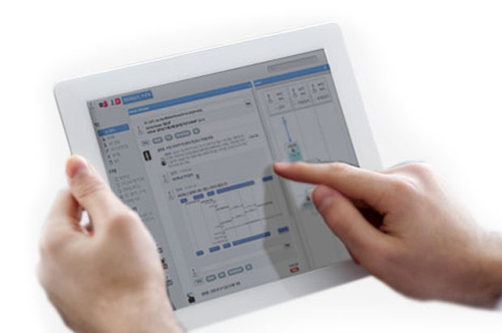
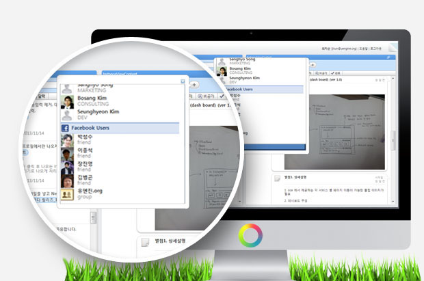

<!-- header 시작 -->

  
CODI

  기업의 프로세스는 더이상 내부 통제와 KPI 를 통해서만 끌어올리는데는 한계에 도달하였습니다. 자발적인 지식공유, 협업, 상호존중의 문화, 보다 수평적인 커뮤니케이션에 의한 집단지성을 이끌어내기 위하여 선진 기업들은 Enterprise 2.0에 주목하였습니다. 더이상 기존의 탑-다운식 정보흐름의 그룹웨어나 포탈은 세련된 여러분의 임직원들의 가능성을 최대한 발휘하게 하지 못합니다. 유엔진의 [프로세스 코디]는 대기업 그룹사와 다양한 기관에서 검증된 기업용 소셜 네트워크 솔루션으로 업무적 맥락을 이해하면서 수평적 협업을 최대한으로 이끌어내도록 UX가 설계되었습니다. 또한 [uEngine BPM] 과 연계되어 통제와 혁신의 밸런스를 유지할 수 있도록 합니다.

<iframe style="width:100%; height:300px;" src="https://www.youtube.com/embed/pSm6hbfNn20" title="YouTube video player" frameborder="0" allow="accelerometer; autoplay; clipboard-write; encrypted-media; gyroscope; picture-in-picture" allowfullscreen>
</iframe>

  

  <a href="https://github.com/TheOpenCloudEngine/process-codi" class="md-button" style="vertical-align:middle">
    Github
  </a>
  <a href="https://uengine.org/assets/docs/CODI_install.pdf" class="md-button" style="vertical-align:middle">
    Guide
  </a>

<!-- header 끝 -->

<!-- pc 시작 -->
<section class="padding-top-110 is-pc">
 

  

   <h2 class="section-title text-uppercase">Features</h2>
  

<!-- 1. 프로세스 개선 시작 -->

<h2 class="font-30 mb-30">프로세스 개선</h2>

코디는 그룹 내 사용하고 있는 혹은 사용하고자 하는 프로세스의 사용이 가능합니다.
   

휴가신청 및 일정관리, 연락처 관리부터 결재, 영업관리 등 그룹 내에서 등록한 프로세스의 실행이 즉각적으로 이루어지며, 
   

플랫폼 내에서 업무의 진행 사항을 확인 할 수 있는 등 기존 BPM의 이점을 그대로 활용 가능합니다.

<!-- 프로세스 개선 끝 -->

<!-- 2. 소셜 워크플로우(UC) 시작 -->

<h2 class="font-30 mb-30">소셜 워크플로우(UC)</h2>

코그룹 내 친구를 추가하여 지식을 공유 할 수 있고 소셜 네트워크의 친구들과의 커뮤니케이션도 업무에 활용해 보세요.
   

소셜네트워크의 친구와 채팅을 통해 혹은 나의 업무를 담벼락에 공유하여 소셜 네트워크 친구들의 의견을 업무에 적극 수용 할 수 있습니다.
   

멀리 떨어진 친구와는 화상회의를 통하여 소통이 가능합니다. 기업 내 혹은 외부의 넓은 네트워크망을 이용하여 창의적인 의사소통으로 향상된 업무능력을 선보이시길 바랍니다.

<!-- 소셜 워크플로우(UC) 끝 -->

<!-- 3. 파일(문서)관리 끝 시작 -->

<h2 class="font-30 mb-30">파일(문서)관리 끝</h2>

코디는 컨텐츠의 한 영역으로 문서를 관리합니다.
   

이미지, 워드, 파워포인트, 엑셀 등 문서의 미리보기를 지원하여 다운로드 없이 플랫폼 내에서 문서의 내용을 손쉽게 확인 할 수 있습니다.
   

문서의 미리보기 영역에 직접 의견을 공유할 수 있습니다. 원하는 포지션에 “코멘트 달기”를 통해서 의견을 공유해 보세요. 또한 문서의 고급 관리로 문서를 버전별로 업로드 가능합니다. 이전에 업로드한 문서의 손실 없이 미리보기 및 다운로드 할 수 있습니다. 또한 문서 내 키워드 검색이 가능합니다.

이제 코디에서 문서에 실시간으로 의견을 공유하고 표시된 영역의 화면을 캡쳐하여 원활한 소통의 도구로 활용해보세요.

<!-- 파일(문서)관리 끝 -->

<!-- 4. 개인직무 및 프로젝트 관리 시작 -->

<h2 class="font-30 mb-30">개인직무 및 프로젝트 관리</h2>

담벼락에 달력을 통해 자신의 업무를 효과적으로 관리 할 수 있습니다.
   

캘린더의 업무를 등록하고, 알림 예약을 통해 지정한 시간에 업무 알림을 받을 수 있습니다.
   

자신이 진행 하여야 할 업무는 “내가 해야할일(TODO List)”에서 따로 확인 할 수 있으며, 간트차트를 통하여 프로젝트의 진행상태를 모니터링 할 수 있습니다.

<!-- 개인직무 및 프로젝트 관리 끝 -->

<!-- 5. 집단지성/매시업 시작 -->

<h2 class="font-30 mb-30">집단지성/매시업</h2>

팀간 혹은 그룹간 더 나아가서 기업간의 공동 작업 공간을 구성합니다. 지식맵을 통하여 집단 지성의 커뮤니티를 구성 할 수 있습니다.
   

지식맵은 wiki의 컨텐츠, 슬라이드쉐어의 슬라이드, 유투브의 동영상, 구글의 이미지 등으로 외부의 컨텐츠의 활용이 가능합니다.
   

실시간으로 검색되는 컨텐츠를 이용하여 지식맵을 구성해 보세요.

<!-- 집단지성/매시업 끝 -->
</section>
<!-- pc 끝 -->

<!-- 모바일 시작 -->
<section class="is-mobile">
<!-- 1. 프로세스 개선 시작 -->

<h2 class="flex justify-center">프로세스 개선</h2>

코디는 그룹 내 사용하고 있는 혹은 사용하고자 하는 프로세스의 사용이 가능합니다.
   

휴가신청 및 일정관리, 연락처 관리부터 결재, 영업관리 등 그룹 내에서 등록한 프로세스의 실행이 즉각적으로 이루어지며, 
   

플랫폼 내에서 업무의 진행 사항을 확인 할 수 있는 등 기존 BPM의 이점을 그대로 활용 가능합니다.

<!-- 1. 프로세스 개선 끝 -->

<!-- 2. 소셜 워크플로우(UC) 시작 -->

<h2 class="flex justify-center">소셜 워크플로우(UC) 시작</h2>

코그룹 내 친구를 추가하여 지식을 공유 할 수 있고 소셜 네트워크의 친구들과의 커뮤니케이션도 업무에 활용해 보세요.
   

소셜네트워크의 친구와 채팅을 통해 혹은 나의 업무를 담벼락에 공유하여 소셜 네트워크 친구들의 의견을 업무에 적극 수용 할 수 있습니다.
   

멀리 떨어진 친구와는 화상회의를 통하여 소통이 가능합니다. 기업 내 혹은 외부의 넓은 네트워크망을 이용하여 창의적인 의사소통으로 향상된 업무능력을 선보이시길 바랍니다.

<!-- 2. 소셜 워크플로우(UC) 시작 -->

<!-- 3. 파일(문서)관리 끝 시작 -->

<h2 class="flex justify-center">파일(문서)관리 끝 시작</h2>

코디는 컨텐츠의 한 영역으로 문서를 관리합니다.

이미지, 워드, 파워포인트, 엑셀 등 문서의 미리보기를 지원하여 다운로드 없이 플랫폼 내에서 문서의 내용을 손쉽게 확인 할 수 있습니다.

문서의 미리보기 영역에 직접 의견을 공유할 수 있습니다. 원하는 포지션에 “코멘트 달기”를 통해서 의견을 공유해 보세요. 또한 문서의 고급 관리로 문서를 버전별로 업로드 가능합니다. 이전에 업로드한 문서의 손실 없이 미리보기 및 다운로드 할 수 있습니다. 또한 문서 내 키워드 검색이 가능합니다.

이제 코디에서 문서에 실시간으로 의견을 공유하고 표시된 영역의 화면을 캡쳐하여 원활한 소통의 도구로 활용해보세요.

<!-- 3. 파일(문서)관리 끝 시작 -->

<!-- 4. 파일(문서)관리 끝 시작 -->

<h2 class="flex justify-center">개인직무 및 프로젝트 관리</h2>

담벼락에 달력을 통해 자신의 업무를 효과적으로 관리 할 수 있습니다.

캘린더의 업무를 등록하고, 알림 예약을 통해 지정한 시간에 업무 알림을 받을 수 있습니다.

자신이 진행 하여야 할 업무는 “내가 해야할일(TODO List)”에서 따로 확인 할 수 있으며, 간트차트를 통하여 프로젝트의 진행상태를 모니터링 할 수 있습니다.

<!-- 4. 파일(문서)관리 끝 시작 -->

<!-- 5. 집단지성/매시업 -->

<h2 class="flex justify-center">집단지성/매시업</h2>

팀간 혹은 그룹간 더 나아가서 기업간의 공동 작업 공간을 구성합니다. 지식맵을 통하여 집단 지성의 커뮤니티를 구성 할 수 있습니다.

지식맵은 wiki의 컨텐츠, 슬라이드쉐어의 슬라이드, 유투브의 동영상, 구글의 이미지 등으로 외부의 컨텐츠의 활용이 가능합니다.

실시간으로 검색되는 컨텐츠를 이용하여 지식맵을 구성해 보세요.

<!-- 5. 집단지성/매시업 -->
</section>